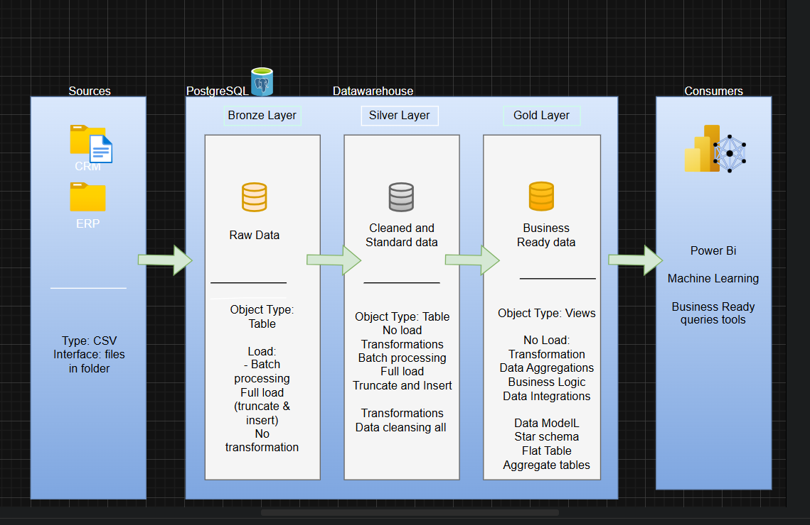
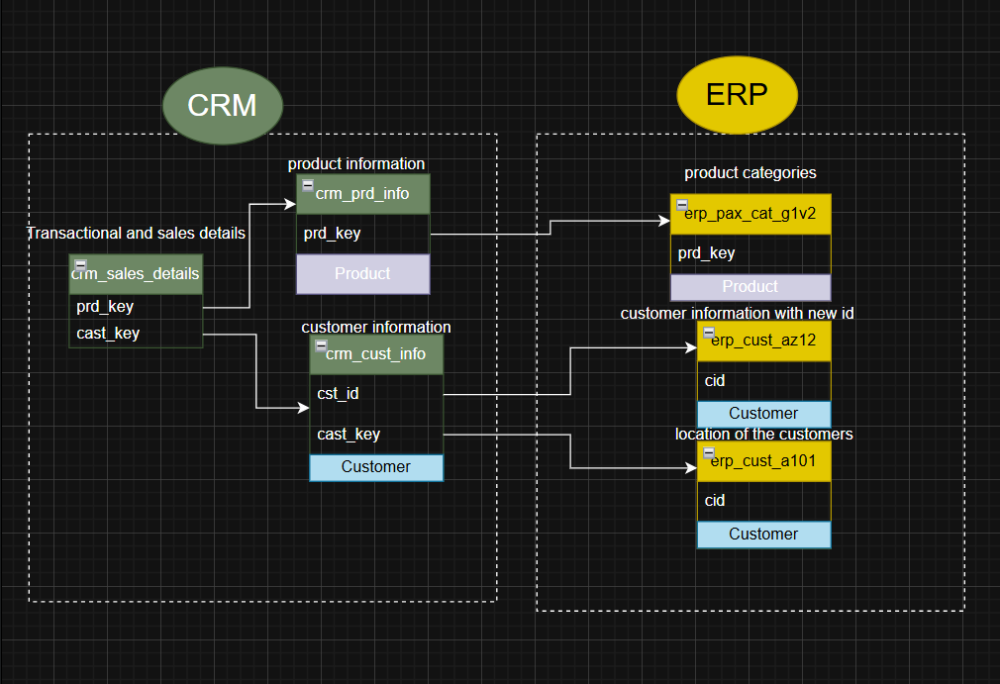
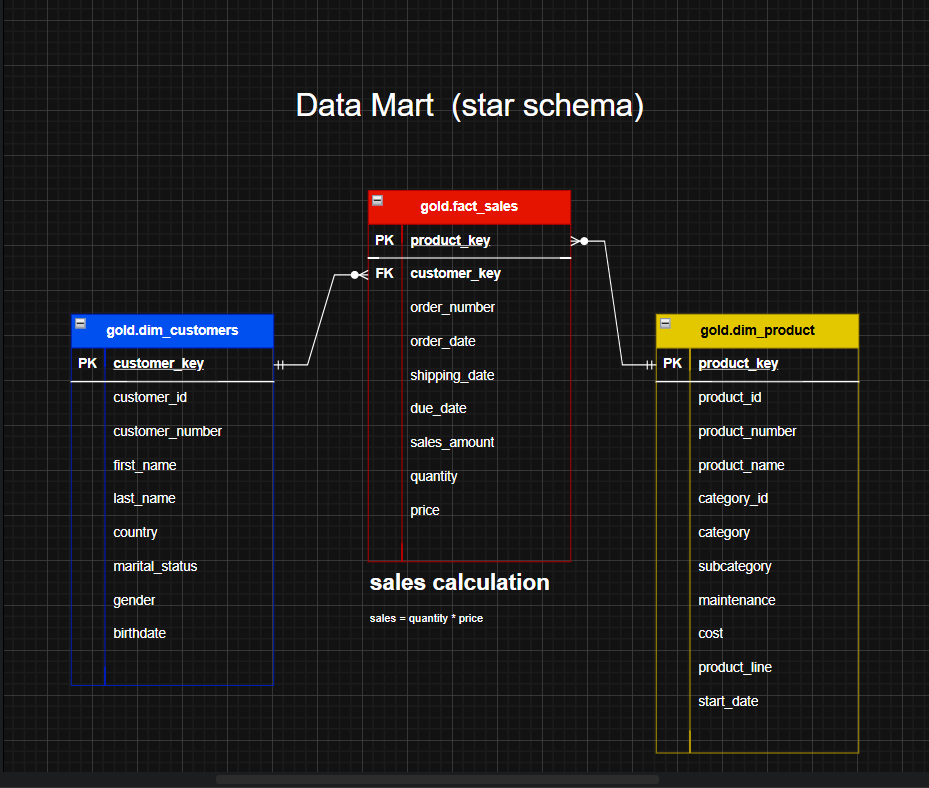

# datawarehouse_sql_project
## building a modern data warehouse using PostGreSQL to consolidate sales data, enabling anlytical reporting and informed decision making.

#### specifications
**Data sources** = import data from two source system (ERP, CRM) provided as csv files
**Data quality** = cleanse and resolve data quality issue prior to analysis.
**Integrations** = combine both source into a single, user-friendly data models designed for analytical queries.
**Scope** = focus on the lastes datset only; hisotircal of data is not required. 

## Power BI : analytical and reporting tool

#### objectives
develop sql based analytical to deliver detailed insights into 
**customer behaviour**
**product preformance**
**sales trends**

# 🛠️ CRM & ERP Data Pipeline with Medallion Architecture

This project implements a robust data pipeline using the **Medallion Architecture** pattern (Bronze → Silver → Gold), handling customer data from the CRM system and product/category/location data from the ERP system. It ensures data quality, transformation, and enrichment for reporting and analytics.

---

## 📁 Project Structure

project-root/
│
├── crm/
│ └── bronze/
│ └── crm_customer_info.csv
│ └── crm_prd_info.csv
│ └── silver/
│ └── cleaned_crm_prd_info.sql
│
├── erp/
│ └── bronze/
│ └── erp_px_cat_g1v2.csv
│ └── erp_sales_product.csv
│ └── erp_location.csv
│ └── silver/
│ └── enriched_product_info.sql
│
├── gold/
│ └── final_customer_product_view.sql
│
├── assets/
│ └── medallion_architecture.png
│
└── README.md

yaml
Copy
Edit

---

## 🧱 Medallion Architecture



---

## 🧾 Data Sources

### CRM Folder
- **crm_customer_info**: Contains customer demographic and contact details.
- **crm_prd_info**: Contains product purchase and subscription details from CRM.

### ERP Folder
- **erp_px_cat_g1v2**: Category Master (Category, Subcategory, Maintenance Flag).
- **erp_sales_product**: Product details like cost, SKU, product line.
- **erp_location**: Location mapping and attributes.

---

## 🧱 data Architecture integration



---

## 🛠️ Data Processing Logic

### ✅ Bronze Layer
- Raw ingestion from CSV/Parquet files (e.g., `crm_prd_info`, `erp_px_cat_g1v2`).
- No major transformation applied.

### ✅ Silver Layer
- Data cleaning, normalization, and enrichment.
- Applied transformations:
  - Extracted `cat_id` from `prd_key`.
  - Used `CASE` statements to derive `prd_line` descriptions.
  - Filled missing `prd_cost` with `0`.
  - Handled Slowly Changing Dimensions (SCD Type 2) logic for `prd_start_dt` and `prd_end_dt`.

> **Important**: `prd_key` is not unique. The valid business key is a combination of `prd_key + prd_start_dt`.

- Filtered current records using:
```sql
WHERE prd_end_dt IS NULL
```
✅ Gold Layer
Final analytical views created by joining:

CRM product info (Silver)

ERP category master

ERP location and sales product

Business validations handled:

Left join between CRM’s cat_id and ERP’s id.

Missing cat_id like 'CO_PE' labeled as 'n/a'.

Business Rules and Assumptions
Rule	Description
Duplicate cat_id	Allowed in CRM — one customer can have multiple products in the same category
Duplicate prd_key	Allowed. Use prd_key + prd_start_dt for uniqueness
Missing Category	Category like 'CO_PE' not found in ERP master → labeled 'n/a'
SCD Handling	Used LEAD() with PARTITION BY prd_key to calculate prd_end_dt

SQL Logic Sample (Silver Transformation)
```sql
SELECT
  prd_id,
  REPLACE(SUBSTRING(prd_key FROM 1 FOR 5), '-', '_') AS cat_id,
  SUBSTRING(prd_key FROM 7) AS prd_key,
  prd_nm,
  COALESCE(prd_cost, 0) AS prd_cost,
  CASE 
    WHEN UPPER(TRIM(prd_line)) = 'M' THEN 'Mountain'
    WHEN UPPER(TRIM(prd_line)) = 'R' THEN 'Road'
    WHEN UPPER(TRIM(prd_line)) = 'S' THEN 'Other Sales'
    WHEN UPPER(TRIM(prd_line)) = 'T' THEN 'Touring'
    ELSE 'n/a'
  END AS prd_line,
  prd_start_dt::DATE,
  CASE
    WHEN LEAD(prd_start_dt) OVER (PARTITION BY prd_key ORDER BY prd_start_dt) IS NULL THEN NULL
    ELSE (LEAD(prd_start_dt) OVER (PARTITION BY prd_key ORDER BY prd_start_dt) - INTERVAL '1 day')::DATE
  END AS prd_end_dt
FROM bronze.crm_prd_info;
```


## 🧱 star Schme integration



---

How to Reproduce
Load raw data into Bronze tables.

Run Silver transformation scripts to clean and enrich data.

Join CRM and ERP views to create final Gold views.

Validations Done
Verified no duplicates on (prd_key, prd_start_dt) in Bronze.

Ensured all prd_end_dt IS NULL records represent current products.

Used LEFT JOINs to preserve CRM product records even when ERP category is missing.

Replaced missing ERP categories with 'n/a'.


